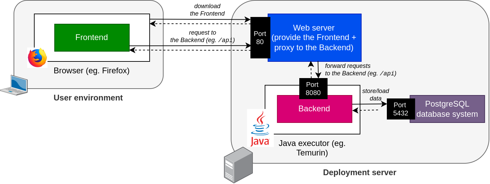

= Boardgamemanager
:sectnums:
:toc:
:icons: font

== Presentation and usage

Boardgamemanager is a web application allowing multiple users to manage collaboratively a catalog of board games.

Once logged in, a user can browse existing registered board games, or add new ones to the catalog.

NOTE: This is a dummy application that has only very basic functionalities!
It's purpose is only to be used for teaching purposes.

== Architecture

Boardgamemanager is architectured as two separate components : the _frontend_ − responsible for the graphical user web interface − and the _backend_ − which contains the real business logic, and receives requests coming from the frontend.
Each of these components is an independent piece of software, and they can be deployed separately.

- The *backend* is developed using the Java language (version 17), and relies on a wide range of Java libraries, such as the https://spring.io/projects/spring-boot[Spring Boot framework] or https://github.com/FasterXML/jackson[Jackson].
All the dependencies are managed automatically using https://maven.apache.org/[Maven].
A PostgreSQL database system is required by the backend to store its data.
- The *frontend* is developed using the TypeScript language, and relies also on a wide range of libraries, such as https://angular.io/[Angular].
All the dependencies are managed automatically using https://www.npmjs.com/[npm].
The frontend must be deployed using a regular web server (such as https://www.nginx.com/[nginx]).
This web server must then both provide the frontend, and act as a proxy to forward requests made by the frontend to the backend.

CAUTION: Since the frontend is purely a graphical web user interface, its code is actually executed in the browser of the user, not on the deployment server.
Then, the frontend (running in the user browser) will send requests to the deployment server in order to reach the backend.
Even though the frontend is not _running_ on the deployment server, do note it must still be _deployed_ on said server using a simple web server.

.Summary of the architecture

NOTE: While this figure only shows a single deployment server, it's of course possible to deploy each component (frontend, backend, database) in a different environment.

== Compiling and running the application

=== Running the backend

Two ways : prod and not prod

if not prod, dummy data

if prod :

Need a postgres server

Then :

SPRING_DATASOURCE_URL="jdbc:postgresql://localhost:8888/boardgamemanager" SPRING_LIQUIBASE_URL="jdbc:postgresql://localhost:8888/boardgamemanager" java -jar target/boardgamemanager-0.0.1-SNAPSHOT.jar

TODO

=== Running the frontend

Will always try to access the backend on the same machine

If executed in the same environment as the backend, OK

If executed in another environment, need a proxy

TODO